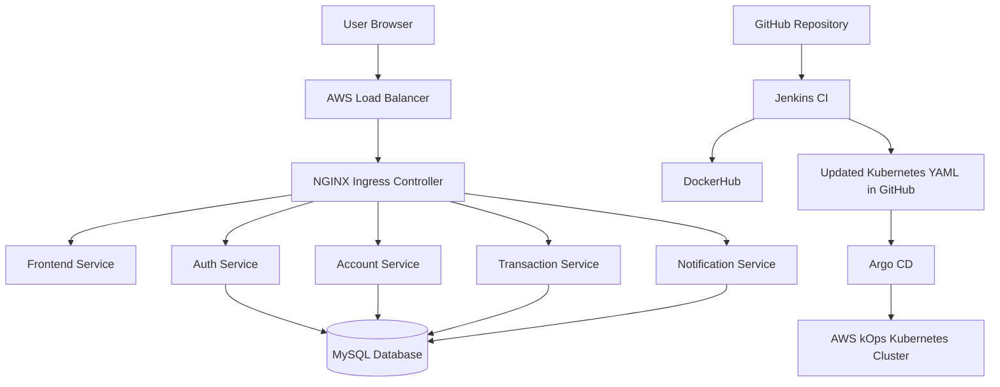

# Banking App Microservices Kubernetes Deployment Project

> **Repository Name:** `Banking-App-Microservices-Kubernetes-Deployment-Project`

A complete DevOps and GitOps project that deploys a DB-connected Banking Microservices Application on an AWS Kubernetes cluster created using **kOps**. The project uses **Jenkins** for CI, **DockerHub** as the image registry, **Argo CD** for GitOps-based CD, **NGINX Ingress** for external routing, **MySQL** for database connectivity, **RBAC** for Kubernetes access control, **HPA** for autoscaling, and **Prometheus + Grafana** for monitoring.

---

## Table of Contents

- [Project Overview](#project-overview)
- [Architecture](#architecture)
- [Project Flow](#project-flow)
- [Tech Stack](#tech-stack)
- [Microservices Overview](#microservices-overview)
- [Repository Structure](#repository-structure)
- [Demo Credentials](#demo-credentials)
- [AWS kOps Cluster Setup](#aws-kops-cluster-setup)
- [Docker Image Build and Push](#docker-image-build-and-push)
- [Kubernetes Deployment](#kubernetes-deployment)
- [Ingress Setup](#ingress-setup)
- [Database Connectivity](#database-connectivity)
- [Jenkins CI Setup](#jenkins-ci-setup)
- [Argo CD GitOps Setup](#argo-cd-gitops-setup)
- [GitHub Webhook Setup](#github-webhook-setup)
- [RBAC Setup](#rbac-setup)
- [HPA Autoscaling](#hpa-autoscaling)
- [Monitoring with Prometheus and Grafana](#monitoring-with-prometheus-and-grafana)
- [Testing Commands](#testing-commands)
- [Screenshots](#screenshots)
- [Troubleshooting](#troubleshooting)
- [Cleanup](#cleanup)
- [Key Learnings](#key-learnings)
- [Conclusion](#conclusion)

---

## Project Overview

This project demonstrates the end-to-end deployment of a banking microservices application on Kubernetes. The application is divided into multiple independent services, each containerized using Docker and deployed as a separate Kubernetes workload.

The project follows a modern CI/CD and GitOps workflow:

```text
Developer Pushes Code
        ↓
GitHub Repository
        ↓
Jenkins CI Pipeline
        ↓
Docker Image Build
        ↓
DockerHub Image Push
        ↓
Jenkins Updates Kubernetes YAML Image Tags
        ↓
Jenkins Pushes Updated YAML to GitHub
        ↓
Argo CD Detects Git Changes
        ↓
Argo CD Syncs Manifests to Kubernetes
        ↓
Application Runs on AWS kOps Kubernetes Cluster
```

---

## Architecture



### Request Routing

```text
/                  → Frontend Service
/auth              → Auth Service
/account           → Account Service
/transactions      → Transaction Service
/notifications     → Notification Service
```

📸 **Add Screenshot Here**

```md

```

---

## Project Flow

### Application Flow

```text
User opens banking website
        ↓
Frontend loads through AWS Load Balancer and NGINX Ingress
        ↓
User logs in with demo credentials
        ↓
Auth service validates credentials from MySQL
        ↓
Dashboard fetches account details from Account Service
        ↓
Transactions page fetches transactions from Transaction Service
        ↓
Notifications page fetches alerts from Notification Service
```

### CI/CD + GitOps Flow

```text
Code Push to GitHub
        ↓
GitHub Webhook triggers Jenkins
        ↓
Jenkins builds Docker images
        ↓
Jenkins pushes images to DockerHub
        ↓
Jenkins updates Kubernetes YAML image tags
        ↓
Jenkins commits YAML changes with [skip ci]
        ↓
Argo CD detects Git change
        ↓
Argo CD syncs updated manifests to Kubernetes
        ↓
New pods are deployed
```

---

## Tech Stack

| Category | Tools |
|---|---|
| Cloud Platform | AWS |
| Kubernetes Cluster | kOps |
| Containerization | Docker |
| Image Registry | DockerHub |
| CI Tool | Jenkins |
| CD / GitOps Tool | Argo CD |
| Orchestration | Kubernetes |
| Web Routing | NGINX Ingress Controller |
| Database | MySQL |
| Monitoring | Prometheus, Grafana |
| Security | Kubernetes RBAC, Secrets |
| Autoscaling | Horizontal Pod Autoscaler |
| Version Control | Git, GitHub |

---

## Microservices Overview

| Service | Folder | Port | Description |
|---|---|---:|---|
| Frontend | `Banking-App/1.frontend` | 80 | Multi-page banking website |
| Auth Service | `Banking-App/2.auth-service` | 3001 | Authenticates users from MySQL |
| Account Service | `Banking-App/3.account-service` | 3002 | Fetches account summary from MySQL |
| Transaction Service | `Banking-App/4.transaction-service` | 3003 | Fetches transaction history from MySQL |
| Notification Service | `Banking-App/5.notification-service` | 3004 | Fetches banking notifications from MySQL |
| MySQL | `k8s/4.mysql.yaml` | 3306 | Stores banking data |

---

## Repository Structure

```text
Banking-App-Microservices-Kubernetes-Deployment-Project/
│
├── Banking-App/
│   ├── 1.frontend/
│   ├── 2.auth-service/
│   ├── 3.account-service/
│   ├── 4.transaction-service/
│   └── 5.notification-service/
│
├── k8s/
│   ├── 1.namespace.yaml
│   ├── 2.mysql-secret.yaml
│   ├── 3.banking-configmap.yaml
│   ├── 4.mysql.yaml
│   ├── 5.frontend.yaml
│   ├── 6.auth-service.yaml
│   ├── 7.account-service.yaml
│   ├── 8.transaction-service.yaml
│   ├── 9.notification-service.yaml
│   ├── 10.ingress-hostless.yaml
│   ├── 11.ingress-domain.yaml
│   ├── 12.rbac.yaml
│   └── 13.hpa.yaml
│
├── screenshots/
├── Jenkinsfile
├── README.md
├── LICENSE
└── .gitignore
```

---

## Demo Credentials

Use these credentials to log in to the banking application:

```text
Customer ID: SHIVAM001
Password: demo123
```

These credentials are stored in MySQL using the database initialization script in:

```text
k8s/4.mysql.yaml
```

---

## AWS kOps Cluster Setup

Set environment variables:

```bash
export AWS_REGION=ap-south-1
export CLUSTER_NAME=banking.k8s.local
export KOPS_STATE_STORE=s3://shivam-kops-state-store-banking
```

Create kOps S3 state store:

```bash
aws s3api create-bucket \
  --bucket shivam-kops-state-store-banking \
  --region ap-south-1 \
  --create-bucket-configuration LocationConstraint=ap-south-1
```

Enable versioning:

```bash
aws s3api put-bucket-versioning \
  --bucket shivam-kops-state-store-banking \
  --versioning-configuration Status=Enabled
```

Create SSH key:

```bash
ssh-keygen -t rsa -b 4096 -f ~/.ssh/kops-key
```

Create Kubernetes cluster:

```bash
kops create cluster \
  --name ${CLUSTER_NAME} \
  --state ${KOPS_STATE_STORE} \
  --zones ap-south-1b \
  --node-count 2 \
  --node-size t3.small \
  --control-plane-count 1 \
  --control-plane-size c7i-flex.large \
  --ssh-public-key ~/.ssh/kops-key.pub \
  --networking calico \
  --yes
```

Export kubeconfig:

```bash
kops export kubecfg \
  --name ${CLUSTER_NAME} \
  --state ${KOPS_STATE_STORE} \
  --admin
```

Validate cluster:

```bash
kops validate cluster \
  --name ${CLUSTER_NAME} \
  --state ${KOPS_STATE_STORE} \
  --wait 10m
```

Check nodes:

```bash
kubectl get nodes
```

📸 **Add Screenshots Here**

```md


```

---

## Docker Image Build and Push

Login to DockerHub:

```bash
docker login
```

Build Docker images:

```bash
docker build -t shiivam22/banking-frontend:v1 ./Banking-App/1.frontend
docker build -t shiivam22/banking-auth-service:v1 ./Banking-App/2.auth-service
docker build -t shiivam22/banking-account-service:v1 ./Banking-App/3.account-service
docker build -t shiivam22/banking-transaction-service:v1 ./Banking-App/4.transaction-service
docker build -t shiivam22/banking-notification-service:v1 ./Banking-App/5.notification-service
```

Push Docker images:

```bash
docker push shiivam22/banking-frontend:v1
docker push shiivam22/banking-auth-service:v1
docker push shiivam22/banking-account-service:v1
docker push shiivam22/banking-transaction-service:v1
docker push shiivam22/banking-notification-service:v1
```

📸 **Add Screenshots Here**

```md


```

---

## Kubernetes Deployment

Apply namespace:

```bash
kubectl apply -f k8s/1.namespace.yaml
```

Apply MySQL secret and configmap:

```bash
kubectl apply -f k8s/2.mysql-secret.yaml
kubectl apply -f k8s/3.banking-configmap.yaml
```

Deploy MySQL:

```bash
kubectl apply -f k8s/4.mysql.yaml
kubectl rollout status deployment/mysql -n banking --timeout=5m
```

Deploy application microservices:

```bash
kubectl apply -f k8s/5.frontend.yaml
kubectl apply -f k8s/6.auth-service.yaml
kubectl apply -f k8s/7.account-service.yaml
kubectl apply -f k8s/8.transaction-service.yaml
kubectl apply -f k8s/9.notification-service.yaml
```

Check pods and services:

```bash
kubectl get pods -n banking -o wide
kubectl get svc -n banking
```

📸 **Add Screenshots Here**

```md


```

---

## Ingress Setup

Install NGINX Ingress Controller for AWS:

```bash
kubectl apply -f https://raw.githubusercontent.com/kubernetes/ingress-nginx/controller-v1.11.3/deploy/static/provider/aws/deploy.yaml
```

Check ingress controller:

```bash
kubectl get pods -n ingress-nginx
kubectl get svc -n ingress-nginx
```

Apply hostless ingress for AWS Load Balancer testing:

```bash
kubectl apply -f k8s/10.ingress-hostless.yaml
```

Check ingress:

```bash
kubectl get ingress -n banking
```

Get AWS Load Balancer DNS:

```bash
kubectl get svc ingress-nginx-controller -n ingress-nginx
```

Open the app:

```text
http://YOUR-AWS-LOAD-BALANCER-DNS
```

📸 **Add Screenshots Here**

```md


```

---

## Database Connectivity

The MySQL deployment creates these tables:

```text
customers
accounts
transactions
notifications
```

Login to MySQL:

```bash
kubectl exec -it deployment/mysql -n banking -- mysql -u securebank_user -pSecureBank@123 securebankdb
```

Check tables:

```sql
SHOW TABLES;
SELECT * FROM customers;
SELECT * FROM accounts;
SELECT * FROM transactions;
SELECT * FROM notifications;
```

Test auth service:

```bash
curl http://YOUR-AWS-LOAD-BALANCER-DNS/auth/health
```

Expected response:

```json
{
  "service": "auth-service",
  "status": "running",
  "database": "connected"
}
```

Test DB-backed login:

```bash
curl -X POST http://YOUR-AWS-LOAD-BALANCER-DNS/auth/login \
  -H "Content-Type: application/json" \
  -d '{"customerId":"SHIVAM001","password":"demo123"}'
```

📸 **Add Screenshots Here**

```md


```

---

## Jenkins CI Setup

Jenkins is used for the CI part of the project:

```text
Build Docker images
Push images to DockerHub
Update Kubernetes YAML image tags
Commit updated YAML files back to GitHub
```

### Jenkins Credentials

Create these credentials in Jenkins:

| Credential ID | Type | Purpose |
|---|---|---|
| `dockerhub-creds` | Username with password | DockerHub login |
| `github-creds` | Username with password | Push updated YAML to GitHub |

### GitHub Token Permissions

Use a fine-grained GitHub token with:

```text
Repository Access: Only selected repository
Contents: Read and write
Metadata: Read-only
```

### Jenkins Pipeline Stages

```text
Checkout Code
Docker Login
Build Docker Images
Push Docker Images
Update Kubernetes YAML Image Tags
Commit Updated YAML to GitHub
Argo CD Deployment Info
```

📸 **Add Screenshots Here**

```md


```

---

## Argo CD GitOps Setup

Argo CD handles the CD part of the project by continuously watching the `k8s/` folder in GitHub.

Install Argo CD:

```bash
kubectl create namespace argocd
kubectl apply -n argocd \
  -f https://raw.githubusercontent.com/argoproj/argo-cd/stable/manifests/install.yaml
```

Check Argo CD pods:

```bash
kubectl get pods -n argocd
```

Access Argo CD UI:

```bash
kubectl port-forward svc/argocd-server -n argocd 8080:443
```

Open:

```text
https://localhost:8080
```

Get admin password:

```bash
kubectl get secret argocd-initial-admin-secret \
  -n argocd \
  -o jsonpath="{.data.password}" | base64 --decode
```

Create Argo CD application:

```yaml
apiVersion: argoproj.io/v1alpha1
kind: Application
metadata:
  name: banking-microservices-app
  namespace: argocd
spec:
  project: default

  source:
    repoURL: https://github.com/Its-Shiivam22/Banking-App-Microservices-Kubernetes-Deployment-Project.git
    targetRevision: main
    path: k8s

  destination:
    server: https://kubernetes.default.svc
    namespace: banking

  syncPolicy:
    automated:
      prune: true
      selfHeal: true
    syncOptions:
      - CreateNamespace=true
```

Apply:

```bash
kubectl apply -f argocd-banking-app.yaml
```

Check application:

```bash
kubectl get applications -n argocd
```

📸 **Add Screenshots Here**

```md


```

---

## GitHub Webhook Setup

A GitHub webhook triggers Jenkins automatically when code is pushed.

Webhook URL:

```text
http://YOUR-JENKINS-PUBLIC-IP:8080/github-webhook/
```

GitHub webhook settings:

```text
Content type: application/json
Event: Just the push event
```

Enable this in Jenkins job:

```text
Build Triggers → GitHub hook trigger for GITScm polling
```

To avoid an infinite loop when Jenkins pushes YAML changes, Jenkins commits with:

```text
[skip ci]
```

📸 **Add Screenshots Here**

```md


```

---

## RBAC Setup

Apply RBAC:

```bash
kubectl apply -f k8s/12.rbac.yaml
```

Test allowed permission:

```bash
kubectl auth can-i get pods \
  --as=system:serviceaccount:banking:banking-reader \
  -n banking
```

Expected:

```text
yes
```

Test denied permission:

```bash
kubectl auth can-i delete pods \
  --as=system:serviceaccount:banking:banking-reader \
  -n banking
```

Expected:

```text
no
```

📸 **Add Screenshot Here**

```md

```

---

## HPA Autoscaling

Install metrics server:

```bash
kubectl apply -f https://github.com/kubernetes-sigs/metrics-server/releases/latest/download/components.yaml
```

Apply HPA:

```bash
kubectl apply -f k8s/13.hpa.yaml
```

Check HPA:

```bash
kubectl get hpa -n banking
```

📸 **Add Screenshot Here**

```md

```

---

## Monitoring with Prometheus and Grafana

Install monitoring stack:

```bash
helm repo add prometheus-community https://prometheus-community.github.io/helm-charts
helm repo update
kubectl create namespace monitoring
helm install monitoring prometheus-community/kube-prometheus-stack -n monitoring
```

Check pods:

```bash
kubectl get pods -n monitoring
```

Access Grafana:

```bash
kubectl port-forward svc/monitoring-grafana 3000:80 -n monitoring
```

Open:

```text
http://localhost:3000
```

Get Grafana password:

```bash
kubectl get secret monitoring-grafana -n monitoring \
  -o jsonpath="{.data.admin-password}" | base64 --decode
```

Recommended dashboards:

```text
Kubernetes / Compute Resources / Cluster
Kubernetes / Compute Resources / Namespace / Pods
Kubernetes / Compute Resources / Node
```

Filter namespace:

```text
banking
```

📸 **Add Screenshots Here**

```md


```

---

## Testing Commands

Check all resources:

```bash
kubectl get all -n banking
```

Check pods:

```bash
kubectl get pods -n banking -o wide
```

Check services:

```bash
kubectl get svc -n banking
```

Check ingress:

```bash
kubectl get ingress -n banking
```

Check MySQL:

```bash
kubectl exec -it deployment/mysql -n banking -- mysql -u securebank_user -pSecureBank@123 securebankdb
```

Test auth login:

```bash
curl -X POST http://YOUR-AWS-LOAD-BALANCER-DNS/auth/login \
  -H "Content-Type: application/json" \
  -d '{"customerId":"SHIVAM001","password":"demo123"}'
```

Check deployment image:

```bash
kubectl describe deployment auth-service -n banking | grep Image
```

---

## Screenshots

Add all screenshots inside the `screenshots/` folder.

Recommended screenshot names:

```text
00-architecture-diagram.png
01-kops-validate-cluster.png
02-kubectl-get-nodes.png
03-docker-images.png
04-dockerhub-images.png
05-kubectl-get-pods.png
06-kubectl-get-services.png
07-ingress-loadbalancer.png
08-homepage.png
09-mysql-tables.png
10-customers-table.png
11-auth-db-connected.png
12-login-success.png
13-jenkins-credentials.png
14-jenkins-pipeline-success.png
15-jenkins-console-output.png
16-argocd-pods.png
17-argocd-application.png
18-argocd-synced-healthy.png
19-github-webhook.png
20-webhook-delivery-success.png
21-rbac-test.png
22-hpa-output.png
23-monitoring-pods.png
24-grafana-dashboard.png
```

---

## Troubleshooting

### Jenkins Error: Could not find credentials entry with ID `dockerhub-creds`

Create a Jenkins credential with exact ID:

```text
dockerhub-creds
```

### Jenkins Error: Could not find credentials entry with ID `github-creds`

Create a Jenkins credential with exact ID:

```text
github-creds
```

### ImagePullBackOff

Check if the Docker image exists in DockerHub:

```bash
docker pull shiivam22/banking-auth-service:v1
```

Check pod events:

```bash
kubectl describe pod POD_NAME -n banking
```

### Login Credentials Not Working

Check customer data:

```bash
kubectl exec -it deployment/mysql -n banking -- mysql -u securebank_user -pSecureBank@123 securebankdb
```

```sql
SELECT * FROM customers;
```

If data is missing, reset MySQL for demo:

```bash
kubectl delete deployment mysql -n banking
kubectl delete pvc mysql-pvc -n banking
kubectl apply -f k8s/4.mysql.yaml
```

### Website Opens but APIs Fail

Check ingress:

```bash
kubectl describe ingress banking-ingress -n banking
```

Check backend services:

```bash
kubectl get svc -n banking
```

Test health endpoint:

```bash
curl http://YOUR-AWS-LOAD-BALANCER-DNS/auth/health
```

### Argo CD Not Syncing

Check application:

```bash
kubectl describe application banking-microservices-app -n argocd
```

Check if Jenkins updated the image tag in GitHub:

```bash
grep -R "image:" k8s/
```

---

## Cleanup

Delete monitoring:

```bash
helm uninstall monitoring -n monitoring
kubectl delete namespace monitoring
```

Delete application namespace:

```bash
kubectl delete namespace banking
```

Delete ingress controller:

```bash
kubectl delete -f https://raw.githubusercontent.com/kubernetes/ingress-nginx/controller-v1.11.3/deploy/static/provider/aws/deploy.yaml
```

Delete Argo CD:

```bash
kubectl delete namespace argocd
```

Delete kOps cluster:

```bash
export CLUSTER_NAME=banking.k8s.local
export KOPS_STATE_STORE=s3://shivam-kops-state-store-banking

kops delete cluster \
  --name ${CLUSTER_NAME} \
  --state ${KOPS_STATE_STORE} \
  --yes
```

Delete S3 state bucket:

```bash
aws s3 rm s3://shivam-kops-state-store-banking --recursive

aws s3api delete-bucket \
  --bucket shivam-kops-state-store-banking \
  --region ap-south-1
```

---

## Key Learnings

Through this project, I implemented:

- AWS Kubernetes cluster creation using kOps
- Microservices deployment on Kubernetes
- Docker image creation and DockerHub push
- Kubernetes Deployments, Services, Secrets, ConfigMaps, PVC, Ingress, RBAC, and HPA
- MySQL database connectivity inside Kubernetes
- Jenkins CI pipeline for Docker image automation
- GitOps-based CD using Argo CD
- GitHub webhook-based pipeline automation
- Kubernetes workload monitoring using Prometheus and Grafana
- Troubleshooting Jenkins, Docker, Kubernetes, MySQL, Ingress, and Argo CD issues

---

## Conclusion

This project demonstrates a complete DevOps lifecycle for a DB-connected banking microservices application. It combines cloud infrastructure, containerization, Kubernetes orchestration, CI/CD automation, GitOps deployment, database connectivity, security, autoscaling, and monitoring.

This project is suitable for DevOps Engineer, Cloud Engineer, Kubernetes Engineer, and SRE fresher portfolio use.
