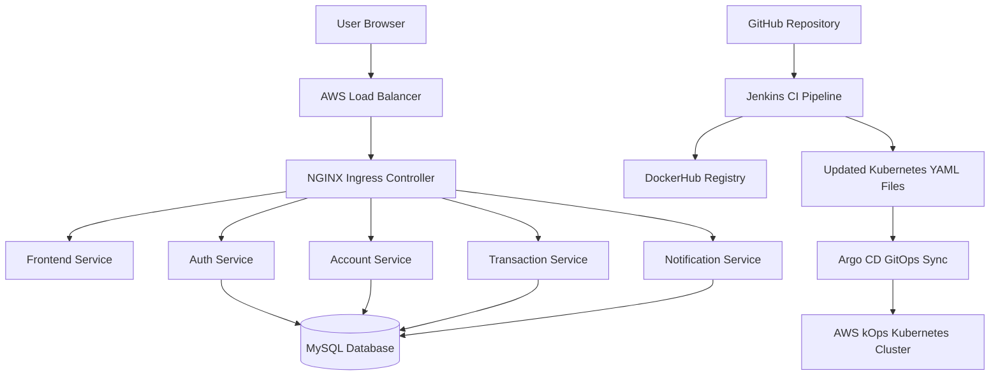
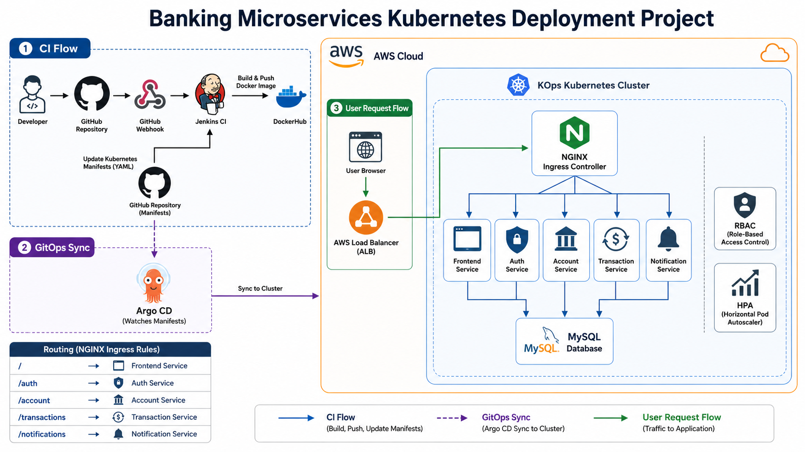

# 🚀 Banking Microservices Application Kubernetes Deployment Project


---

## 📌 Project Overview

This project demonstrates the deployment of a **DB-connected Banking Microservices Application** on an **AWS Kubernetes cluster created using kOps**.

The application is divided into multiple independent microservices. Each service is containerized using Docker and deployed on Kubernetes. The project includes a multi-page frontend, authentication service, account service, transaction service, notification service, MySQL database connectivity, Kubernetes manifests, NGINX Ingress routing, Jenkins CI pipeline, Argo CD GitOps deployment, GitHub webhook automation, Kubernetes RBAC, and Horizontal Pod Autoscaler.

This project represents a complete DevOps workflow from source code to automated deployment on Kubernetes.

---

## 🏗️ Architecture Flow

```text
User Browser
     |
     v
AWS Load Balancer
     |
     v
NGINX Ingress Controller
     |
     |-- /                  → Frontend Service
     |-- /auth              → Auth Service
     |-- /account           → Account Service
     |-- /transactions      → Transaction Service
     |-- /notifications     → Notification Service
                              |
                              v
                         MySQL Database
```

---

## 🧭 Architecture Diagram using Mermaid



---

## 🔄 CI/CD and GitOps Flow

```text
Developer Pushes Code to GitHub
        |
        v
GitHub Webhook Triggers Jenkins
        |
        v
Jenkins Builds Docker Images
        |
        v
Jenkins Pushes Images to DockerHub
        |
        v
Jenkins Updates Kubernetes YAML Image Tags
        |
        v
Jenkins Commits Updated YAML Files to GitHub
        |
        v
Argo CD Detects GitHub Changes
        |
        v
Argo CD Syncs Kubernetes Manifests
        |
        v
Updated Application Runs on AWS kOps Kubernetes Cluster
```

---

## 📸 Architecture Diagram

<p align="center">
  
</p>

```text
Screenshots/1.Architecture-Diagram.png
```

---

## 🧰 Tools and Technologies Used

| Category | Tools / Services |
|---|---|
| Cloud Platform | AWS |
| Kubernetes Cluster | kOps |
| Containerization | Docker |
| Image Registry | DockerHub |
| CI Tool | Jenkins |
| CD / GitOps Tool | Argo CD |
| Orchestration | Kubernetes |
| Ingress Controller | NGINX Ingress Controller |
| Database | MySQL |
| Autoscaling | Horizontal Pod Autoscaler |
| Security | Kubernetes RBAC, Secrets |
| Version Control | Git and GitHub |
| Automation | GitHub Webhook |

---

## 🧩 Microservices Overview

| Service | Folder | Port | Description |
|---|---|---:|---|
| Frontend | `Banking-App/1.frontend` | 80 | Multi-page banking web application |
| Auth Service | `Banking-App/2.auth-service` | 3001 | Handles login and authentication |
| Account Service | `Banking-App/3.account-service` | 3002 | Fetches customer account details |
| Transaction Service | `Banking-App/4.transaction-service` | 3003 | Fetches transaction history |
| Notification Service | `Banking-App/5.notification-service` | 3004 | Fetches customer notifications |
| MySQL Database | `k8s/4.mysql.yaml` | 3306 | Stores banking application data |

---

## 📁 Repository Structure

```text
Banking-App-Microservices-Kubernetes-Deployment-Project/
│
├── Banking-App/
│   ├── 1.frontend/
│   ├── 2.auth-service/
│   ├── 3.account-service/
│   ├── 4.transaction-service/
│   └── 5.notification-service/
│
├── k8s/
│   ├── 1.namespace.yaml
│   ├── 2.mysql-secret.yaml
│   ├── 3.banking-configmap.yaml
│   ├── 4.mysql.yaml
│   ├── 5.frontend.yaml
│   ├── 6.auth-service.yaml
│   ├── 7.account-service.yaml
│   ├── 8.transaction-service.yaml
│   ├── 9.notification-service.yaml
│   ├── 10.ingress-hostless.yaml
│   ├── 11.ingress-domain.yaml
│   ├── 12.rbac.yaml
│   └── 13.hpa.yaml
│
├── Screenshots/
├── Jenkinsfile
├── README.md
├── LICENSE
└── .gitignore
```

---

# 📌 Part 1: kOps Kubernetes Cluster Setup on AWS EC2

Before creating the Kubernetes cluster using kOps, an EC2 instance is launched as a management server.

This EC2 instance is used to install and run the required DevOps tools such as:

```text
AWS CLI
kubectl
kOps
Docker
Git
```

Note: The Kubernetes cluster is not created inside this EC2 instance.
This EC2 instance is used only as a control machine to run kOps commands. kOps will create separate AWS resources such as control plane nodes, worker nodes, networking resources, and load balancers.

Open EC2 Dashboard

Open AWS Console and go to:
```text
AWS Console → EC2 → Instances → Launch Instance
```

<p align="center">
  
</p>


Configure Instance Settings:
Name: K8S
Ami: Amazon Linux 2023
Instance Type: c7i-flex.large
VPC: Default VPC 
Subnet: Public Subnet 
Auto-assign Public IP: Enable
Default Security Group
Storage:
Root - 20 GB Gp3

Attached IAM Role to the Instance:
```text
EC2 → Instance → Actions → Security → Modify IAM Role
```

<p align="center">
  
</p>


For learning/demo purposes, attach:
```AdministratorAccess```

For production, use a least-privilege IAM policy instead of full administrator access.

## 🌐 Cluster Overview

The Kubernetes cluster is created on AWS using kOps. kOps provisions the required AWS resources and configures the Kubernetes control plane and worker nodes.

| Component | Configuration |
|---|---|
| Region | `ap-south-1` |
| Cluster Name | `banking.k8s.local` |
| State Store | S3 Bucket |
| Control Plane | 1 Node |
| Worker Nodes | 2 Nodes |
| Networking | Calico |

---

## 🔹 Configure AWS CLI

```bash
aws configure
```

Verify AWS identity:

```bash
aws sts get-caller-identity
```

---

## 🔹 Set Environment Variables

```bash
export AWS_REGION=ap-south-1
export CLUSTER_NAME=banking.k8s.local
export KOPS_STATE_STORE=s3://shivam-kops-state-store-banking
```

---

## 🔹 Create S3 State Store

```bash
aws s3api create-bucket \
  --bucket shivam-kops-state-store-banking \
  --region ap-south-1 \
  --create-bucket-configuration LocationConstraint=ap-south-1
```

Enable versioning:

```bash
aws s3api put-bucket-versioning \
  --bucket shivam-kops-state-store-banking \
  --versioning-configuration Status=Enabled
```

---

## 🔹 Create SSH Key

```bash
ssh-keygen -t rsa -b 4096 -f ~/.ssh/kops-key
```

---

## 🔹 Create kOps Cluster

```bash
kops create cluster \
  --name ${CLUSTER_NAME} \
  --state ${KOPS_STATE_STORE} \
  --zones ap-south-1b \
  --node-count 2 \
  --node-size t3.small \
  --control-plane-count 1 \
  --control-plane-size c7i-flex.large \
  --ssh-public-key ~/.ssh/kops-key.pub \
  --networking calico \
  --yes
```

---

## 🔹 Export kubeconfig

```bash
kops export kubecfg \
  --name ${CLUSTER_NAME} \
  --state ${KOPS_STATE_STORE} \
  --admin
```

---

## 🔹 Validate Cluster

```bash
kops validate cluster \
  --name ${CLUSTER_NAME} \
  --state ${KOPS_STATE_STORE} \
  --wait 10m
```

Check nodes:

```bash
kubectl get nodes
```

### Screenshot

<p align="center">
  
</p>

<p align="center">
  
</p>

---

# 📌 Part 2: Docker Image Build and Push

## 🐳 Docker Overview

Each microservice has a separate Dockerfile and is pushed as an independent image to DockerHub.

Docker images used:

```text
shiivam22/banking-frontend
shiivam22/banking-auth-service
shiivam22/banking-account-service
shiivam22/banking-transaction-service
shiivam22/banking-notification-service
```

---

## 🔹 Docker Login

```bash
docker login
```

---

## 🔹 Build Docker Images

```bash
docker build -t shiivam22/banking-frontend:v1 ./Banking-App/1.frontend
docker build -t shiivam22/banking-auth-service:v1 ./Banking-App/2.auth-service
docker build -t shiivam22/banking-account-service:v1 ./Banking-App/3.account-service
docker build -t shiivam22/banking-transaction-service:v1 ./Banking-App/4.transaction-service
docker build -t shiivam22/banking-notification-service:v1 ./Banking-App/5.notification-service
```

---

## 🔹 Push Docker Images

```bash
docker push shiivam22/banking-frontend:v1
docker push shiivam22/banking-auth-service:v1
docker push shiivam22/banking-account-service:v1
docker push shiivam22/banking-transaction-service:v1
docker push shiivam22/banking-notification-service:v1
```

### Screenshot

<p align="center">
  
</p>

<p align="center">
  
</p>

---

# 📌 Part 3: Kubernetes Deployment

## ⚙️ Kubernetes Resources Used

```text
Namespace
Deployment
Service
ConfigMap
Secret
PersistentVolumeClaim
Ingress
ServiceAccount
Role
RoleBinding
HorizontalPodAutoscaler
```

---

## 🔹 Create Namespace

```bash
kubectl apply -f k8s/1.namespace.yaml
```

---

## 🔹 Apply Secret and ConfigMap

```bash
kubectl apply -f k8s/2.mysql-secret.yaml
kubectl apply -f k8s/3.banking-configmap.yaml
```

---

## 🔹 Deploy MySQL

```bash
kubectl apply -f k8s/4.mysql.yaml
kubectl rollout status deployment/mysql -n banking --timeout=5m
```

---

## 🔹 Deploy Microservices

```bash
kubectl apply -f k8s/5.frontend.yaml
kubectl apply -f k8s/6.auth-service.yaml
kubectl apply -f k8s/7.account-service.yaml
kubectl apply -f k8s/8.transaction-service.yaml
kubectl apply -f k8s/9.notification-service.yaml
```

---

## 🔹 Verify Deployment

```bash
kubectl get pods -n banking -o wide
kubectl get deploy -n banking
kubectl get svc -n banking
```

### Screenshot

<p align="center">
  
</p>

<p align="center">
  
</p>

---

# 📌 Part 4: MySQL Database Connectivity

## 🗄️ Database Overview

The MySQL database stores application data for all banking services.

Database tables:

```text
customers
accounts
transactions
notifications
```

The backend services connect to MySQL using the internal Kubernetes service:

```text
mysql-service
```

---

## 🔹 Login to MySQL

```bash
kubectl exec -it deployment/mysql -n banking -- mysql -u securebank_user -pSecureBank@123 securebankdb
```

---

## 🔹 Verify Tables

```sql
SHOW TABLES;
SELECT * FROM customers;
SELECT * FROM accounts;
SELECT * FROM transactions;
SELECT * FROM notifications;
```

### Screenshot

<p align="center">
  
</p>

<p align="center">
  
</p>

---

## 🔹 Test Login API

```bash
curl -X POST http://YOUR-AWS-LOAD-BALANCER-DNS/auth/login \
  -H "Content-Type: application/json" \
  -d '{"customerId":"SHIVAM001","password":"demo123"}'
```

Expected response:

```json
{
  "message": "Login successful. Welcome Shivam Ekale.",
  "customerId": "SHIVAM001",
  "fullName": "Shivam Ekale",
  "token": "secure-db-demo-token"
}
```

---

# 📌 Part 5: NGINX Ingress and AWS Load Balancer

## 🌐 Ingress Overview

NGINX Ingress Controller is used to expose the banking application outside the Kubernetes cluster. It provisions an AWS Load Balancer and routes incoming traffic to the correct services.

---

## 🔹 Install NGINX Ingress Controller

```bash
kubectl apply -f https://raw.githubusercontent.com/kubernetes/ingress-nginx/controller-v1.11.3/deploy/static/provider/aws/deploy.yaml
```

Check controller:

```bash
kubectl get pods -n ingress-nginx
kubectl get svc -n ingress-nginx
```

---

## 🔹 Apply Hostless Ingress

```bash
kubectl apply -f k8s/10.ingress-hostless.yaml
```

Check ingress:

```bash
kubectl get ingress -n banking
```

Get Load Balancer DNS:

```bash
kubectl get svc ingress-nginx-controller -n ingress-nginx
```

Application URL:

```text
http://YOUR-AWS-LOAD-BALANCER-DNS
```

### Screenshot

<p align="center">
  
</p>

---

# 📌 Part 6: Jenkins CI Pipeline

## 🔧 Jenkins Overview

Jenkins is used for Continuous Integration.

Jenkins performs:

```text
Checkout source code
Build Docker images
Push Docker images to DockerHub
Update Kubernetes YAML image tags
Commit updated YAML files back to GitHub
```

The actual Kubernetes deployment is handled by Argo CD using GitOps.

---

## 🔹 Jenkins Credentials

| Credential ID | Type | Purpose |
|---|---|---|
| `dockerhub-creds` | Username with password | DockerHub login |
| `github-creds` | Username with password | Push updated YAML files to GitHub |

---

## 🔹 DockerHub Token

Use a DockerHub access token as the password for:

```text
dockerhub-creds
```

---

## 🔹 GitHub Token

Use a fine-grained GitHub token with:

```text
Repository Access: Only selected repository
Contents: Read and write
Metadata: Read-only
```

Use this token as the password for:

```text
github-creds
```

---

## 🔹 GitHub Webhook for Jenkins

Webhook URL:

```text
http://YOUR-JENKINS-PUBLIC-IP:8080/github-webhook/
```

Webhook settings:

```text
Content Type: application/json
Event: Just the push event
```

Enable in Jenkins job:

```text
Build Triggers → GitHub hook trigger for GITScm polling
```

To avoid a CI loop, Jenkins commits YAML changes with:

```text
[skip ci]
```

### Screenshot

<p align="center">
  
</p>

<p align="center">
  
</p>

<p align="center">
  
</p>

---

# 📌 Part 7: Argo CD GitOps Deployment

## 🔁 Argo CD Overview

Argo CD is used for GitOps-based Continuous Deployment.

Argo CD watches the `k8s/` directory in the GitHub repository. When Jenkins updates image tags in the Kubernetes manifests and pushes the changes to GitHub, Argo CD automatically syncs those changes to the Kubernetes cluster.

---

## 🔹 Install Argo CD

```bash
kubectl create namespace argocd
kubectl apply -n argocd \
  -f https://raw.githubusercontent.com/argoproj/argo-cd/stable/manifests/install.yaml
```

Check pods:

```bash
kubectl get pods -n argocd
```

---

## 🔹 Access Argo CD UI

```bash
kubectl port-forward svc/argocd-server -n argocd 8080:443
```

Open:

```text
https://localhost:8080
```

Username:

```text
admin
```

Get password:

```bash
kubectl get secret argocd-initial-admin-secret \
  -n argocd \
  -o jsonpath="{.data.password}" | base64 --decode
```

---

## 🔹 Create Argo CD Application

```yaml
apiVersion: argoproj.io/v1alpha1
kind: Application
metadata:
  name: banking-microservices-app
  namespace: argocd
spec:
  project: default

  source:
    repoURL: https://github.com/Its-Shiivam22/Banking-App-Microservices-Kubernetes-Deployment-Project.git
    targetRevision: main
    path: k8s

  destination:
    server: https://kubernetes.default.svc
    namespace: banking

  syncPolicy:
    automated:
      prune: true
      selfHeal: true
    syncOptions:
      - CreateNamespace=true
```

Apply:

```bash
kubectl apply -f argocd-banking-app.yaml
```

Check:

```bash
kubectl get applications -n argocd
```

### Screenshot

<p align="center">
  
</p>

<p align="center">
  
</p>

<p align="center">
  
</p>

---

# 📌 Part 8: Kubernetes RBAC

## 🔐 RBAC Overview

RBAC controls access to Kubernetes resources.

This project creates:

```text
ServiceAccount: banking-reader
Role: banking-read-only-role
RoleBinding: banking-read-only-binding
```

---

## 🔹 Apply RBAC

```bash
kubectl apply -f k8s/12.rbac.yaml
```

---

## 🔹 Test RBAC

Allowed:

```bash
kubectl auth can-i get pods \
  --as=system:serviceaccount:banking:banking-reader \
  -n banking
```

Expected:

```text
yes
```

Denied:

```bash
kubectl auth can-i delete pods \
  --as=system:serviceaccount:banking:banking-reader \
  -n banking
```

Expected:

```text
no
```

### Screenshot

<p align="center">
  
</p>

---

# 📌 Part 9: Horizontal Pod Autoscaler

## 📈 HPA Overview

Horizontal Pod Autoscaler automatically scales pods based on CPU utilization.

---

## 🔹 Install Metrics Server

```bash
kubectl apply -f https://github.com/kubernetes-sigs/metrics-server/releases/latest/download/components.yaml
```

---

## 🔹 Apply HPA

```bash
kubectl apply -f k8s/13.hpa.yaml
```

Check HPA:

```bash
kubectl get hpa -n banking
```

### Screenshot

<p align="center">
  
</p>

---

# 📌 Part 10: Application Testing

## ✅ Test Website

Open:

```text
http://YOUR-AWS-LOAD-BALANCER-DNS
```

Login:

```text
Customer ID: SHIVAM001
Password: demo123
```

---

## ✅ Test Health Endpoints

```bash
curl http://YOUR-AWS-LOAD-BALANCER-DNS/auth/health
curl http://YOUR-AWS-LOAD-BALANCER-DNS/account/health
curl http://YOUR-AWS-LOAD-BALANCER-DNS/transactions/health
curl http://YOUR-AWS-LOAD-BALANCER-DNS/notifications/health
```

---

## ✅ Test Kubernetes Resources

```bash
kubectl get all -n banking
kubectl get pods -n banking -o wide
kubectl get svc -n banking
kubectl get ingress -n banking
kubectl get hpa -n banking
```

---

# 🎥 Application Demo Video

This video demonstrates the working deployment of the **Banking Microservices Kubernetes Project**, including frontend access, DB-backed login, service routing, Jenkins CI, Argo CD GitOps sync, RBAC, and HPA.

<p align="center">
  <a href="YOUR-YOUTUBE-DEMO-LINK">
    
  </a>
</p>

<h4 align="center">📌 Click on the image above to watch the full demo on YouTube.</h4>

---

## 🖼️ Screenshots

<p align="center">
  
</p>

<p align="center">
  
</p>

<p align="center">
  
</p>

<p align="center">
  
</p>

<p align="center">
  
</p>

---

# 🛠️ Challenges Faced

## 1. Jenkins DockerHub Credentials Error

### Challenge

Jenkins failed with:

```text
ERROR: Could not find credentials entry with ID 'dockerhub-creds'
```

### Solution

Created Jenkins credentials with the exact ID:

```text
dockerhub-creds
```

---

## 2. Avoiding Jenkins Webhook Loop

### Challenge

Jenkins pushes updated YAML files back to GitHub, which can trigger the webhook again.

### Solution

Added `[skip ci]` in Jenkins commit messages to prevent infinite build loops.

---

## 3. Argo CD Image Update Detection

### Challenge

Using a fixed image tag like `v1` does not always trigger a GitOps sync.

### Solution

Used dynamic image tags:

```text
v1-${BUILD_NUMBER}
```

---

## 4. Database Connectivity

### Challenge

Backend microservices needed to connect to MySQL inside Kubernetes.

### Solution

Used Kubernetes Secrets, ConfigMaps, internal service discovery, and environment variables.

---

# 💰 Cost Optimization

To reduce AWS cost:

- Use small EC2 instances for practice
- Stop or delete unused Jenkins EC2 instances
- Delete unused Load Balancers
- Delete unused EBS volumes
- Delete the kOps cluster after the demo
- Keep the S3 state bucket only while the cluster is needed

Cost-generating services:

```text
EC2 Instances
EBS Volumes
AWS Load Balancer
S3 State Store
CloudWatch Logs
Data Transfer
```

---

# 🎯 Learning Outcomes

This project demonstrates hands-on experience with:

- AWS kOps Kubernetes cluster creation
- Kubernetes Deployments and Services
- Kubernetes Secrets and ConfigMaps
- MySQL database deployment inside Kubernetes
- PersistentVolumeClaim for database storage
- Microservices deployment on Kubernetes
- NGINX Ingress Controller
- AWS Load Balancer integration
- Docker image creation and DockerHub push
- Jenkins CI pipeline
- GitHub webhook automation
- Argo CD GitOps deployment
- Kubernetes RBAC
- Horizontal Pod Autoscaler
- Kubernetes troubleshooting
- Complete DevOps CI/CD workflow

---

# 🧹 Cleanup

## Delete Application Namespace

```bash
kubectl delete namespace banking
```

---

## Delete Argo CD

```bash
kubectl delete namespace argocd
```

---

## Delete NGINX Ingress Controller

```bash
kubectl delete -f https://raw.githubusercontent.com/kubernetes/ingress-nginx/controller-v1.11.3/deploy/static/provider/aws/deploy.yaml
```

---

## Delete kOps Cluster

```bash
export CLUSTER_NAME=banking.k8s.local
export KOPS_STATE_STORE=s3://shivam-kops-state-store-banking

kops delete cluster \
  --name ${CLUSTER_NAME} \
  --state ${KOPS_STATE_STORE} \
  --yes
```

---

## Delete kOps S3 State Store

```bash
aws s3 rm s3://shivam-kops-state-store-banking --recursive

aws s3api delete-bucket \
  --bucket shivam-kops-state-store-banking \
  --region ap-south-1
```

---

# 📜 License

This project is licensed under the **MIT License**.

---

# 👨‍💻 Author

## Shivam Ekale

AWS Certified Solutions Architect – Associate  
Cloud & DevOps Engineer

### Connect With Me

- GitHub: https://github.com/Its-Shiivam22
- LinkedIn: https://www.linkedin.com/in/shiivam22
- Portfolio: https://www.shivamekale.in
- Email: shivamekale07@gmail.com

---

# ⭐ Support

If you found this project helpful, consider giving it a ⭐ on GitHub.
